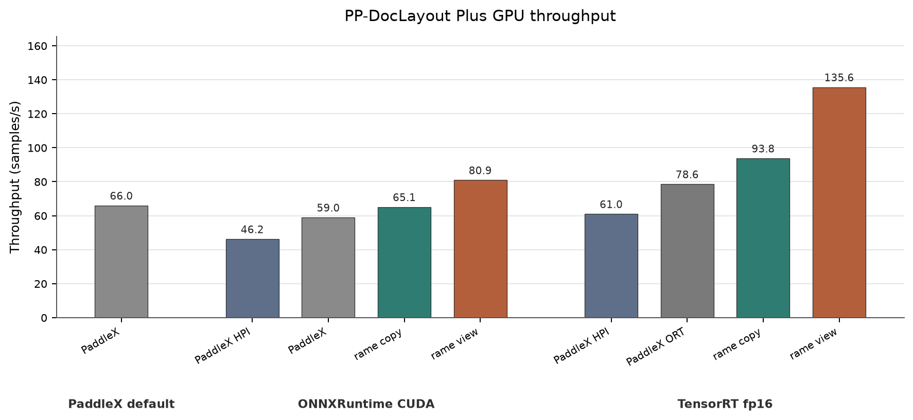

<div align="center">

# rame


Model-aware inference runtime.

</div>

`rame` provides high-level Rust APIs for model families with maintained runtime
integrations. It hides preprocessing, tensor names, inference sessions, and
postprocessing behind model-specific interfaces.

Execution is delegated to engines such as ONNX Runtime. `rame` focuses on the
runtime layer around those engines: artifacts, typed inputs and outputs,
benchmarking, and eventually serving.

## Architecture

```text
source -> loader -> runner -> result
```

- **source**: resolves model files (HuggingFace or local path).
- **loader**: binds an exported package and backend to a semantic model and
  constructs its runner.
- **runner**: owns the loaded resources and execution flow for a model.
- **processor**: converts user inputs into named backend tensors.
- **session**: runs the inference backend. ONNX Runtime is the first backend.
- **decoder**: converts backend output tensors into typed model results.

## Rust Usage

```rust
use rame::layout::LayoutModel;
use rame::models::pp_doclayout::plus;
use rame::runtime::ModelLoader;
use rame::sources::HuggingFace;

let source = HuggingFace::new()?.model("PaddlePaddle/PP-DocLayout_plus-L_onnx");

let mut model = plus::onnx::Loader::default().load(source)?;

let result = model.detect_layout(&image)?;
```

## Benchmark

**Spec:** RTX 4090, batch size 8.

**Dataset:** `opendatalab/OmniDocBench`.

**PP-DocLayout Plus throughput on GPU.**



| Runner      | Backend                   | Python input |        Throughput |
|-------------|---------------------------|--------------|------------------:|
| PaddleX     | CUDA                      |              |  66.010 samples/s |
| PaddleX HPI | ONNXRuntime CUDA          |              |  46.232 samples/s |
| PaddleX     | ONNXRuntime CUDA          |              |  58.977 samples/s |
| rame        | ONNXRuntime CUDA          | copy         |  65.126 samples/s |
| rame        | ONNXRuntime CUDA          | view         |  80.944 samples/s |
| PaddleX HPI | TensorRT fp16             |              |  61.012 samples/s |
| PaddleX     | ONNXRuntime TensorRT fp16 |              |  78.579 samples/s |
| rame        | TensorRT fp16             | copy         |  93.760 samples/s |
| rame        | TensorRT fp16             | view         | 135.631 samples/s |

`PaddleX HPI` uses PaddleX's UltraInfer-based high-performance inference plugin.
PaddleX [notes](https://paddlepaddle.github.io/PaddleX/3.5/en/pipeline_deploy/high_performance_inference.html#3-frequently-asked-questions) that HPI may not accelerate every model, and here it doesn't. `copy` and
`view` are rame's Python input modes: `view` avoids copying the input image but keeps the GIL held during inference.

## Supported Models

| Model                       | Task             | Format |
|-----------------------------|------------------|--------|
| PaddleOCR PP-DocLayout Plus | Layout detection | ONNX   |

More model integrations will be added as their preprocessing and decoding
contracts are implemented.
